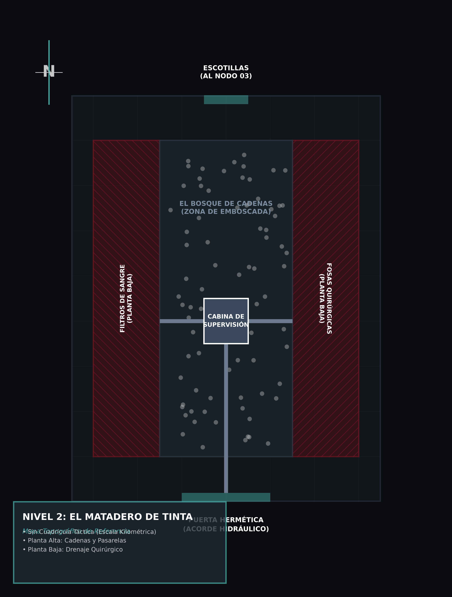

# Módulo 01: Contenedores Vacíos

Este módulo está diseñado como una **experiencia de tutorial inmersivo**. Los jugadores inician la campaña con amnesia total y sin haber llenado su hoja de personaje. A medida que avanzan, irán "recordando" sus especializaciones, atributos y trasfondos mediante una mecánica de ingeniería inversa llamada *Recuerdo Muscular*.

El módulo inicia con la selección orgánica de especie: los jugadores no leen el manual ni saben cómo se llama su raza. Simplemente "despiertan" y eligen la anatomía que sienten.

### Nota de Diseño: El Reflejo en los Otros (Rasgos de Personalidad)
A diferencia de una creación de personaje estándar, en este inicio amnésico **los jugadores dejarán en blanco sus 5 Rasgos de Personalidad**. Ya que no saben quiénes son, no pueden definir cómo reaccionan al mundo. En su lugar, aplicaremos la mecánica de "El Reflejo".
Durante el transcurso de este módulo (y a lo largo de múltiples sesiones), los rasgos no serán decididos por el propio jugador, sino que **los demás jugadores en la mesa se los irán asignando** basados en cómo lo ven actuar. Si un jugador dice ser "calculador" pero es el primero en saltar de un acantilado, la mesa puede asignarle orgánicamente el rasgo *Impulsivo*. La personalidad del personaje será, literalmente, la impresión ineludible que proyecta a los demás.

---

## Acto I: El Despertar

El Narrador no debe pedir hojas de personaje, ni explicar el mundo. Empieza la sesión leyendo el siguiente texto a los jugadores:

> *Escuchan el chasquido de un mecanismo ahogado. El líquido espeso y tibio en el que estaban suspendidos comienza a drenarse velozmente a través de unas rejillas bajo tus pies, dejándote al vacío. Tratas de respirar y el aire frío entra quemando tus pulmones, como si fuera la primera vez que los usas. Estás desnudo, desorientado y tienes un frío sepulcral. Una luz tenue y enfermiza se filtra a través del cristal que te encierra, apenas suficiente para romper la oscuridad. El espacio en el que te encuentras es curvo, liso y asfixiantemente estrecho.*
> 
> *Tiemblas. Tratas de estirarte y tus extremidades golpean contra las paredes curvas de cristal sólido o resina. Estás atrapado. No sabes quién eres ni cómo llegaste aquí. Solo tienes una certeza inmediata: tu propio cuerpo.*
> 
> *Te miras las manos bajo esa luz mortecina y recorres tu anatomía. ¿Qué es lo que ves y sientes?*

En este momento, el Narrador entrega a los jugadores la lista de **Las 20 Siluetas**. Los jugadores solo leen las descripciones y eligen el cuerpo que prefieran.

Una vez que un jugador elige una silueta, el Narrador le revela en secreto (o en voz alta) el **nombre de su especie** y sus **bonificadores de características iniciales**. Aún no saben nada de su cultura, pero ya tienen una fisicalidad con la que interactuar.

---

## Menú de Cuerpos (Las 20 Siluetas)

Entréguese esta lista a los jugadores. Pídeles que elijan una sola opción. No reveles los nombres entre paréntesis hasta que hayan tomado su decisión.

- **Silueta 01:** Sientes un cuerpo esbelto, ágil y serpentino, cubierto por completo de escamas finas. Incluso en esta penumbra, puedes percibir el rastro de calor en el aire; al abrir la boca, una lengua bífida entra y sale instintivamente para probar el entorno. Sientes el peso de una larga y musculosa cola que te ayuda a mantener el equilibrio. *(El Jugador anota: Naghii)*.

- **Silueta 02:** Sientes un cuerpo inmenso y pesado de proporciones reptilianas. Tu espalda está protegida por una densa armadura de gruesas escamas. Sientes una gran letargia y frío en tu sangre, anhelando instintivamente una fuente de calor. Tu mandíbula es inmensa y rígida, una trampa mortal; de tu espina se proyecta una cola gruesa, dándote la certeza de ser un depredador acorazado y absoluto. *(El Jugador anota: Sauri)*.

- **Silueta 03:** Sientes un cuerpo de complexión densa y resistente, cubierto por un pelaje áspero. Tu mandíbula es inusualmente pesada y poderosa, diseñada no solo para morder, sino para triturar hueso. Tus manos terminan en garras hechas para hurgar y desgarrar, y de tu garganta pugna por salir un sonido áspero, corto y gutural, casi como una risa rota o un ladrido. *(El Jugador anota: Zarnag)*.

- **Silueta 04:** Sientes un peso colosal en la espalda. Un inmenso caparazón óseo está fusionado a tu esqueleto, protegiéndote como a una fortaleza andante. Tu cuerpo no está hecho para la velocidad, sino para una resistencia inquebrantable. Tienes garras macizas, una mandíbula dura similar a un pico y un extraño zumbido en la cabeza, como una brújula interna que te permite percibir el magnetismo del lugar. *(El Jugador anota: Drak'kai)*.

- **Silueta 05:** Sientes un cuerpo extraordinariamente ligero, sostenido por un esqueleto que parece casi hueco. En lugar de piel o escamas, estás cubierto por un denso plumaje. Tus brazos son amplios y aerodinámicos, recordando alas ancestrales que te otorgan un equilibrio perfecto. Tienes enormes ojos frontales que captan cada detalle en la penumbra y una boca endurecida en forma de pico afilado. *(El Jugador anota: Rokhart)*.

- **Silueta 06:** Sientes un exoesqueleto quitinoso que recubre tu cuerpo como una coraza biológica. Sobre tu cabeza se alzan un par de antenas; a través de ellas, el aire te bombardea incesantemente con sabores químicos y rastros invisibles que abruman tu mente, como si estuvieras forzado a asimilar el mundo entero de golpe. Tienes densas mandíbulas y sientes en tus músculos una urgencia tenaz, una inercia biológica que te empuja a un trabajo infatigable. *(El Jugador anota: Formix)*.
- **Silueta 07:** Sientes un cuerpo colosal y abrumadoramente pesado, cubierto por una gruesa piel semejante al cuero curtido. De tu rostro se proyecta una larga trompa, un apéndice tan sensible que capta densidades y rastros en el aire que tu mente aún no sabe cómo procesar. A los lados sientes el peso de dos inmensos colmillos curvados. Notas una vibración sorda e incesante en tu pecho, un pulso profundo que emites de forma involuntaria y que resuena con todo tu entorno, cargándote con un peso invisible. *(El Jugador anota: Loxod)*.
- **Silueta 08:** Sientes una anatomía masiva y acorazada, atada a la tierra por una gravedad implacable. De tu denso rostro óseo brota un pesado cuerno, pero no se siente solo como un arma: vibra y reacciona al entorno con una violencia casi dolorosa. El espacio a tu alrededor se percibe saturado de ruido y presiones invisibles que golpean constantemente tu rostro, exigiéndote decidir instintivamente si debes embestir o resistir. *(El Jugador anota: Ceratox)*.
- **Silueta 09:** Sientes tu cuerpo envuelto en una coraza oscura y rígida, un exoesqueleto tenso y blindado. Tus extremidades terminan en pesadas garras articuladas, diseñadas instintivamente para apresar y someter. Sientes el inquietante peso de un largo apéndice curvo surgiendo de tu espalda baja, un aguijón cargado y listo para inyectar veneno. Estás desorientado, pero tu anatomía te infunde un rigor letal: sientes que podrías soportar el peor de los castigos sin quebrarte, para devolverlo con un golpe definitivo. *(El Jugador anota: Chelicer)*.
- **Silueta 10:** Sientes un cuerpo pequeño, ligero y recubierto de pelo. Tienes la complexión nervuda de un ágil primate bípedo. Tu musculatura rechaza la quietud; se siente como un resorte tenso, biológicamente diseñado para trepar, colgarse y saltar al menor estímulo. Sientes una necesidad frenética de que tus manos toquen y evalúen todo a tu alrededor. En tu interior arde un nivel de energía caótico, un pulso abrumador que exige acción inmediata antes de que logres articular un solo pensamiento. *(El Jugador anota: Panin)*.
- **Silueta 11:** Sientes un cuerpo colosal y masivo, protegido por una densa capa de pelaje áspero. Tienes una fuerza física abrumadora y tus pesadas manos terminan en garras diseñadas para aferrar y nunca soltar. Sientes en tus músculos una terquedad biológica extrema; tu organismo absorbe el dolor y el cansancio transformándolos en simple fricción física, otorgándote la certeza absoluta de haber sido forjado para soportar lo insostenible. *(El Jugador anota: Ursari)*.
- **Silueta 12:** Sientes un cuerpo de constitución magra y fibrosa, recubierto de pelaje. Tu postura se inclina de forma natural hacia adelante, tensa y preparada para iniciar una persecución implacable. Sientes un vacío físico y opresivo en el pecho al notar que estás solo; tu biología te exige desesperadamente la presencia de una manada. Bajo tu piel palpita una furia oscura, un hambre depredadora y latente dispuesta a devorar tu cordura y tomar el control absoluto al menor estímulo violento. *(El Jugador anota: Luphran)*.
- **Silueta 13:** Sientes un cuerpo de centro de gravedad bajo, ágil y de postura inclinada, diseñado instintivamente para trepar y adherirte donde otros caerían. En la cara interna de tus muñecas palpitan unas glándulas ocultas que segregan una humedad espesa y pegajosa. Tu sistema nervioso está hipersensibilizado a las vibraciones; la superficie lisa y vacía del contenedor te hace sentir sordo y vulnerable, exigiéndote tender hilos o redes a tu alrededor para poder sentir el mundo. Cerca de tu boca descubres un par de colmillos articulados, cargados y listos para inyectar un veneno paralizante. *(El Jugador anota: Arakhel)*.
- **Silueta 14:** Sientes un cuerpo compacto, ancho y pesado. Tu piel, de una textura húmeda y finamente rugosa, se siente extraordinariamente porosa, como si tu organismo absorbiera directamente la humedad y los rastros químicos del aire que te rodea. Sobre tu rostro sobresalen unos inmensos globos oculares que te otorgan una visión casi panorámica. En la base de tu nuca palpitan unas pesadas glándulas inflamadas, y dentro de tu boca sientes una lengua gruesa, larga y contráctil, como un músculo letal listo para dispararse. *(El Jugador anota: Bufoni)*.
- **Silueta 15:** Sientes un cuerpo de tórax profundo, brazos inusualmente largos y manos terminadas en garras finas. Sientes un alivio instintivo al notar la estrechez de este encierro; tu biología parece diseñada para la geometría confinada. De tu garganta escapan pulsos y chasquidos casi inaudibles, y descubres, fascinado, que el rebote del sonido en las paredes te permite construir un mapa mental perfecto del contenedor, percibiéndolo con mucha más claridad que con la vista misma. *(El Jugador anota: Vesper)*.
- **Silueta 16:** Sientes un cuerpo de tamaño pequeño y constitución fibrosa. Tus músculos operan en un estado de hiperactividad constante, temblando levemente. La quietud de este contenedor te genera una ansiedad asfixiante, un terror biológico a permanecer inmóvil. Sin embargo, notas algo contradictorio: la penumbra y la confusión del encierro te resultan extrañamente familiares, como si tu mente estuviera diseñada para hallar confort en el caos y la inestabilidad. Al intentar moverte, tus extremidades no responden con fluidez, sino con espasmos bruscos e impredecibles, listos para alejarte de cualquier daño antes de que puedas pensarlo. *(El Jugador anota: Lapinni)*.
- **Silueta 17:** Sientes un cuerpo increíblemente ligero y flexible, diseñado para moverse en absoluto silencio. Tu anatomía es fluida, perfecta para trepar y mantener el equilibrio, aunque careces de masa y peso bruto. En tus manos descubres unas finas garras retráctiles. Tu primer instinto al despertar no es explorar, sino quedarte completamente quieto y fundirte con las sombras; sientes que tu cuerpo rechaza de forma natural la idea de ser visto, operando bajo la directriz instintiva de no dejar rastro. *(El Jugador anota: Kesh)*.
- **Silueta 18:** Sientes un cuerpo de tamaño pequeño, pero extraordinariamente denso y macizo. Tus manos terminan en pesadas garras dentadas, forjadas biológicamente para quebrar la piedra. Notas algo peculiar en tu visión: a pesar de la luz tenue de este encierro, ves tu entorno inmediato con una claridad absoluta y nítida. Sin embargo, al intentar enfocar la vista hacia los rincones más lejanos del lugar, el mundo se vuelve irremediablemente borroso e indescifrable. En tu pecho sientes unos pulmones profundos y pesados, diseñados para filtrar un aire mucho más denso, envolviéndote en una sensación de confort dentro de este espacio cerrado. *(El Jugador anota: Talpán)*.
- **Silueta 19:** Sientes un cuerpo pequeño y de complexión nervuda, recubierto por un pelaje denso. Tu caja torácica vibra incesantemente bajo el esfuerzo de un corazón que parece latir a cientos de pulsaciones por minuto, quemando energía a un ritmo tan violento que sientes un hambre inmediata y atroz. Experimentas el paso del tiempo como una avalancha sensorial; el silencio y la quietud de este encierro te resultan de una lentitud casi dolorosa. En tu boca palpitan unos colmillos estriados que segregan una saliva espesa y adormecedora, y sientes la latente y perturbadora capacidad biológica de apagar voluntariamente tus propios pensamientos para entregarte ciegamente al puro instinto motriz. *(El Jugador anota: Soricin)*.
- **Silueta 20:** Sientes un cuerpo imponente y robusto, protegido por un grueso manto de pelo áspero. Tienes un rostro alargado, labios gruesos y un cuello fuerte. Sientes el flujo de una sangre extrañamente densa recorriendo tus venas, infundiéndote una sensación de resistencia inagotable; tu biología se percibe forjada para absorber y tolerar castigos ambientales extremos. En tu abdomen sientes la pesada presencia de un órgano adicional, una recámara interna que parece concentrar una acidez sofocante, generándote el impulso instintivo de contraer el diafragma y purgar violentamente ese líquido ardiente por la boca. *(El Jugador anota: Yacani)*.

---

## Resolución de la Elección

Una vez que los jugadores han elegido, el Narrador les dice en secreto (o públicamente, si no hay problema con el metajuego en la mesa):

> *"La anatomía que has elegido corresponde a la especie de los **[Nombre de la Especie]**. Anótalo en tu hoja. Por ahora, no recuerdas tus costumbres ni de qué civilización vienes. Todo lo que tienes son los instintos básicos de tu fisiología. Anota también tus bonificadores iniciales de especie (ej: +1 Fuerza, +1 Tenacidad)."*

## Acto II: El Recuerdo Muscular

La primera prueba del juego no solo consiste en escapar, sino en descubrir, a través del estrés, a qué se dedicaban los personajes antes de perder la memoria. El cristal no se romperá por sí solo y el oxígeno se agota velozmente.

El Narrador debe plantear la situación ofreciendo deliberadamente **pistas** que apelen a los cinco Trasfondos del juego. Lee el siguiente texto:

> *"El aire frío se agota y el pánico intenta apoderarse de ti, pero tu cuerpo tiene memoria. El cristal frente a ti es sólido. ¿A qué instinto te aferras para salir de aquí? ¿Confías en la fuerza bruta o en la agilidad de tus músculos? ¿Usas tu intuición e improvisación para sobrevivir? ¿Analizas la ingeniería del tubo buscando un fallo en el diseño? ¿Intentas identificar la tecnología del lugar usando tu intelecto? ¿O te impones con absoluta autoridad para organizar a los demás en este caos?"*

### Resolución, Trasfondos y Afinidad Mayor

Pide a cada jugador que describa su acción en base a las pistas dadas. La mecánica fluye de la siguiente manera:
1. Dependiendo del enfoque, el Narrador les revela su **Trasfondo**. El jugador lo anota en la primera página de su hoja de personaje.
2. El Narrador les pide realizar su primera **Tirada de Especialización (T.E.)** contra una Dificultad base de **4** (tutorial), sugiriendo la Especialización que mejor encaje con su descripción (ej. *Acrobacias, Percepción, Liderazgo*).
3. Al ser la primera vez que usan esa Especialización, los jugadores la anotan en la tercera página de su hoja. Dado que pertenece a la rama de atributos de su recién descubierto Trasfondo, marcan inmediatamente la casilla de **Afinidad Mayor (AF)**.
4. Normalmente, una Especialización nueva se anota en Nivel 0, pero al estar re-descubriendo su verdadera naturaleza, los jugadores inician directamente marcando el **Nivel de Competencia 1** en ella.
5. Finalmente, debido a que acaban de subir un rango de competencia, desencadenan su primera **Sinapsis**: deben aumentar en `+1` la Característica (Atributo base) asociada a esa Especialización en la primera página de su hoja.

A continuación, se detalla cómo el Narrador debe resolver mecánicamente cada enfoque:

#### 1. Enfoque Físico: El Artista Marcial
- **La Acción:** El jugador decide golpear, patear, o usar la fuerza bruta o acrobática de su cuerpo contra la resina.
- **La Resolución:** El Narrador le pide una T.E. de una Especialización de **Fuerza**, **Agilidad** o **Tenacidad** (ej: *Lanzamiento, Acrobacias* o *Tolerancia*). Al impactar el cristal, su cuerpo adopta una postura de combate perfecta sin lastimarse. El cristal estalla bajo un impacto técnicamente impecable.
- **Asignación:** El jugador anota el Trasfondo **Artista Marcial**. Registra la Especialización utilizada y le marca su **Afinidad Mayor (AF)**.

#### 2. Enfoque de Supervivencia: El Errante
- **La Acción:** El jugador confía en su instinto, improvisa herramientas con partes sueltas del interior del tubo o busca puntos ciegos.
- **La Resolución:** El Narrador le pide una T.E. de una Especialización de **Astucia** (ej: *Intuición, Improvisación* o *Supervivencia*). Las manos del jugador se mueven guiadas por instinto callejero, desarmando un panel o forzando la apertura antes de quedarse sin aire.
- **Asignación:** El jugador anota el Trasfondo **Errante**. Registra la Especialización utilizada y le marca su **Afinidad Mayor (AF)**.

#### 3. Enfoque Técnico: El Artesano
- **La Acción:** El jugador palpa el material, evalúa el diseño de la estructura cilíndrica y busca desactivar los sellos herméticos.
- **La Resolución:** El Narrador le pide una T.E. de una Especialización de **Sabiduría** (ej: *Percepción, Ingeniería* o *Trampas*). La mente del jugador percibe automáticamente las tensiones estructurales. Con movimientos precisos, desactiva la compuerta mecánicamente como si lo hubiera hecho mil veces.
- **Asignación:** El jugador anota el Trasfondo **Artesano**. Registra la Especialización utilizada y le marca su **Afinidad Mayor (AF)**.

#### 4. Enfoque Académico: El Custodio
- **La Acción:** El jugador analiza los químicos restantes, observa los patrones de la arquitectura o intenta leer los símbolos de advertencia.
- **La Resolución:** El Narrador le pide una T.E. de una Especialización de **Intelecto** (ej: *Identificación, Historia* o *Arquitectura*). Identifica la resina o los comandos del tubo. Mediante deducción, causa una reacción química o desactiva el seguro lógico, abriendo el contenedor sin usar fuerza.
- **Asignación:** El jugador anota el Trasfondo **Custodio**. Registra la Especialización utilizada y le marca su **Afinidad Mayor (AF)**.

#### 5. Enfoque Social: El Noble
- **La Acción:** El jugador se niega a entrar en pánico solo. Exige orden, grita para coordinar a los demás o impone su voluntad para someter al propio sistema.
- **La Resolución:** El Narrador le pide una T.E. de una Especialización de **Presencia** (ej: *Liderazgo* o *Intimidación*). Al hablar, la voz del jugador proyecta una autoridad antinatural. Un compañero en pánico obedece su orden y lo libera, o los comandos biométricos ceden ante su presencia asertiva.
- **Asignación:** El jugador anota el Trasfondo **Noble**. Registra la Especialización utilizada y le marca su **Afinidad Mayor (AF)**.

---

### La Caída al Foso (La Pulcritud Vesper)
Una vez que todos los jugadores describan sus acciones, superen sus pruebas y logren forzar sus respectivos encierros, caerán abruptamente sobre un suelo de basalto negro bellamente pulido, frío como el hielo y surcado por canales geométricos tallados con precisión. Jadeando, empapados del líquido amnésico e intentando asimilar sus nuevas identidades, están oficialmente en libertad en un entorno acústicamente estéril e impecable.

Pero la aventura apenas comienza.

---

## Acto III: El Foso de Gestación

Con las mentes vacías pero sus instintos biológicos activos, los personajes ahora enfrentan el mundo real. Este es el momento de romper la calma estéril de la arquitectura Vesper con un caos repentino.

### 1. El Colapso Ambiental (La Huida)

#### Condiciones Ambientales del Foso
*   **Iluminación (Oscuridad casi absoluta):** La única fuente de luz son los parpadeos biológicos de las vainas rotas y la bioluminiscencia tenue del líquido amnésico. Mecánicamente actúa como la luz de una **Vela** dispersa (Rango visual efectivo: 2 m).
*   **Visibilidad:** Más allá de esos 2 metros, los personajes están bajo *Oscuridad absoluta* (Rango: 0 m). Si intentan interactuar o percibir amenazas lejanas (como los trozos de techo cayendo), dependen por completo del oído o sus sentidos especiales.

El Narrador no debe dar detalles tácticos de inmediato, sino construir la atmósfera de tensión. Justo después de que asimilen su liberación, lee o parafrasea lo siguiente:

> *"El lugar en el que han caído no es un calabozo común. Es una inmensa bóveda acústica de piedra pulida. Sin embargo, el impecable silencio se rompe con un crujido sordo muy por encima de ustedes. El inmenso saco biológico que palpita incrustado en el centro del techo sufre una violenta convulsión. De repente, enormes trozos de resina translúcida y vainas sin eclosionar comienzan a llover desde la penumbra como rocas afiladas, destrozándose violentamente contra el impecable basalto.*

*(Nota: Esta es una escena de acción puramente narrativa para mantener el ritmo alto. El Narrador debe incentivar a los jugadores a describir cómo corren y esquivan los escombros pesados hacia los muros curvos del foso, donde la lluvia de resina no los alcanza).*

### 2. El Hallazgo en la Huida
Mientras se pegan contra los gruesos muros de piedra cóncava para salvarse del colapso central, los jugadores logran rodear el foso hasta llegar a lo que parece ser la única salida: un pesado portón de piedra.
A los pies del portón, yacen **tres cadáveres**, parcialmente aplastados por inmensos trozos de resina.

Al acercarse a investigar, descubren la naturaleza de sus captores y su abrupto final:
- Son criaturas de tórax profundo, rostros achatados y orejas inmensas, vestidas con túnicas de cuero endurecido y corazas de hueso pulido. (Si algún jugador tira *Identificación* o *Supervivencia*, reconocerá que son de la especie **Vesper**).
- No fueron asesinados en un combate frontal. Murieron desesperados, intentando operar los mandos de apertura del portón cuando el techo colapsó sobre ellos durante el violento nacimiento de la aberración superior. Lo que sea que escapó del saco del techo, destrozó este lugar al nacer.

### 3. El Almacén de Contención (El Segundo Recuerdo Muscular)
El portón principal está completamente trabado por el impacto y el peso de los escombros, impidiendo la salida directa. Sin embargo, a su lado hay una pequeña bóveda lateral con su puerta semiabierta. Los jugadores se lanzan al interior buscando refugio seguro, y la lluvia de escombros cesa, dejándolos en una calma tensa. 

Este cuarto era el almacén de contención donde los Vesper guardaban las armaduras y el armamento rústico que usaban para someter y probar a los "sujetos".

Al entrar, descubren bastidores con armas forjadas y petos colgados en la penumbra. El Narrador debe pedirles a los jugadores que elijan con qué vestirse y armarse. Al igual que con su Trasfondo, sus manos se mueven por puro **Recuerdo Muscular** hacia aquello que les resulta familiar.

#### 3.1. El Hallazgo del Ancla (El Primer Recuerdo Emocional)
Mientras se equipan buscando entre las pilas de pertrechos, descubren un cajón de descarte donde los Vesper arrojaban las pertenencias confiscadas a los sujetos antes de arrojarlos al foso. Al rebuscar allí, sucede algo inesperado:

El Narrador se dirige a cada jugador y le indica que, entre la basura y las correas manchadas, encuentra **un pequeño objeto personal**. No saben cómo llegó allí ni recuerdan toda la historia detrás de él, pero al tocarlo, la fría amnesia se quiebra por un segundo y el corazón se les acelera. 

**Mecánica Narrativa:** El Narrador pide a cada jugador que invente qué es este objeto (ej. un relicario abollado, una moneda tallada, una bufanda bordada, un anillo extraño). Luego, les pide que definan **quién se los dio o a quién pertenece**. Este es su primer **Pilar de Biografía (El Ancla)**. El personaje acaba de recordar nítidamente a una persona fundamental de su vida (un ser amado, un mentor, un familiar perdido o alguien a quien juraron venganza). Este objeto físico debe anotarse en su inventario como un recordatorio material de su humanidad.

**Importante:** Tras equiparse, los personajes **NO ganan Competencia** ni en las armas ni en las armaduras. Simplemente copian los valores en su hoja. La verdadera competencia se descubrirá orgánicamente más adelante, durante su primer combate táctico real.

#### Referencia Rápida: Armaduras (Grado 1)
El Narrador indicará a los jugadores que llenen las 5 filas de la tabla ZONAS de la Página 2 (Cabeza, Torso, Brazos, Piernas, Pies) con los mismos valores, dependiendo del estilo táctico que elijan:

| Zona | Armadura (Tipo/Material) | Bloqueo (BC + BM) | Durabilidad | Bonif. (Evasión/Agilidad) |
| :--- | :--- | :---: | :---: | :--- |
| *(Todas)* | **Ligera (Cuero)** | **3** *(BC 2 + BM 1)* | **10** | Evasión Completa, Agilidad Completa |
| *(Todas)* | **Intermedia (Hierro)** | **6** *(BC 4 + BM 2)* | **14** | Evasión Completa, Agilidad a la Mitad |
| *(Todas)* | **Pesada (Acero)** | **9** *(BC 6 + BM 3)* | **20** | Evasión a la Mitad, Agilidad No Aplica |

*(Nota: Al ser Nivel 0, la Competencia Defensiva es 0 y no deben sumar nada adicional al Bloqueo).*

Cada pieza otorga además un **bonificador pasivo** según la zona que cubre y la categoría. Al ser Grado 1, todos los valores son **+1**:

| Pieza | Ligera | Intermedia | Pesada |
| :--- | :--- | :--- | :--- |
| **Casco** | +1 a Preparación | +1 a T.E. de Compostura | +1 a T.R. contra conmoción, ceguera y aturdimiento |
| **Peto** | +3 a Aguante | +2 a Aguante | +1 a Aguante |
| **Brazales** | +1 a T.A. en Técnicas Reactivas | +1 a T.A. en Técnicas Activas | +1 a T.I. en Técnicas Activas |
| **Pantalón** | +1 a T.E. de Agilidad | +1 a T.E. de Fuerza | +1 a T.E. de Tenacidad |
| **Botas** | +1 al movimiento | +1 a tiradas reactivas (equilibrio, esquivar efectos de área) | +1 a T.R. contra derribo, desplazamiento y desestabilización |

*(Nota: El Peto ligero da más Aguante porque permite mayor libertad de movimiento; el pesado lo restringe).*

#### Referencia Rápida: Armas Insignia (Grado 1)
Los jugadores toman un arma del almacén. **No anotan Nivel de Competencia**. Todas las armas disponibles en el bastidor están forjadas en Hierro (excepto la honda, que es de cuero) para que la decisión sea puramente por estilo de juego y no por "min-maxing".

| Arma (Insignia) | Tipo (Familia) | Característica | Potencia | Durabilidad |
| :--- | :--- | :--- | :---: | :---: |
| **Dory (Hierro)** | Lanza | Agilidad | 12 | 14 |
| **Skeggox (Hierro)** | Hacha | Fuerza | 12 | 14 |
| **Khopesh (Hierro)** | Hoja Larga | Tenacidad | 12 | 14 |
| **Kris (Hierro)** | Daga | Astucia | 12 | 14 |
| **Schiavona (Hierro)**| Hoja Larga | Sabiduría | 12 | 14 |
| **Kusari Fundo (Hierro)**| Arma Flexible | Astucia | 12 | 14 |
| **Francisca (Hierro)**| Arma Arrojadiza | Fuerza | 12 (Hoja) | 14 (Hoja) |
| **Balearic (Cuero)** | Arma a Distancia | Agilidad | 3 | 10 |

### 4. La Amenaza en el Silencio
Mientras terminan de armarse y asimilan que quienes los tenían cautivos acaban de ser masacrados por algo mucho peor, ocurre el primer contacto indirecto con el verdadero terror del módulo.

El Narrador pide silencio en la mesa y describe:
> *"La geometría de esta bóveda está diseñada para que ningún sonido escape. Y de repente, a través de los gruesos muros de piedra, escuchan un eco vibrar en el suelo. No es un grito ni un rugido. Es el sonido húmedo de carne arrastrándose pesadamente y de hueso contra piedra. Algo inmenso, deforme e impuro está respirando con dificultad en las bóvedas contiguas. Y sea lo que sea, sabe que ustedes acaban de despertar."*

A partir de este momento, el tutorial del Foso termina y los jugadores tienen un objetivo físico claro: salir hacia los corredores antes de que la Aberración los alcance.

---

## Acto IV: La Ascensión (Tiradas de Especialización)
*(Nota para el Narrador: Utiliza el mapa visual `assets/maps/mapa_01.png` para ubicar espacialmente a los jugadores. Cada zona mencionada aquí corresponde a la numeración del plano).*

### 1. El Corredor de Sangre [Salas 1 a 3]
El Portón Principal del **Foso de Gestación [1]** cede con relativa facilidad, pues sus pesados sellos biométricos de hueso y resina fueron reventados desde afuera por lo que sea que mató a los Vesper. Al empujarlo, ingresan al **Corredor [3]**, un túnel angosto y curvo de 10 metros de largo por apenas 1.5 metros de ancho. El basalto oscuro está seccionado por un canal central de sangre coagulada que drena de vuelta hacia el Foso.

Al final del túnel oscuro, su avance se topa con un muro vertical.

### 2. El Pozo Vertical [Sala 4]
El pasillo no continúa hacia adelante, sino hacia arriba. Han llegado a una "chimenea" de ascenso o pozo vertical de **8 metros de altura**.
- **El Entorno:** Las paredes son de piedra curva. Existen ranuras y escalones tallados geométricamente, pensados para las garras de los Vesper. Sin embargo, la piedra está marcada por profundos y recientes surcos, demostrando que la aberración que escapó era una criatura repulsivamente ágil y letal, capaz de escalar el muro a una velocidad aterradora.
- **La Dificultad (Humedad):** Además de la altura (8 metros), las hendiduras están recubiertas de humedad constante, musgo bioluminiscente resbaladizo y la sangre viscosa que la criatura dejó al subir hacia el Nivel 2. 

Este es el primer obstáculo físico del juego. El sonido húmedo de la biomasa remanente arrastrándose a sus espaldas funciona como un *reloj narrativo* de tensión: no pueden quedarse debatiendo por horas; tienen que subir rápido.

### 3. Resolución Mecánica (Narrativa Abierta)
En *Transcendence*, las soluciones no están predefinidas por el módulo; nacen de la interacción de los jugadores con su entorno. El Narrador debe describir el húmedo pozo de 8 metros y preguntar a la mesa: *"¿Qué hacen para lograr subir?"*.
Dependiendo de la idea propuesta, el Narrador asignará la **Tirada de Especialización** o **Atributo** adecuada. Ejemplos de enfoques:
- **Físico:** Si deciden trepar a pulso puro, arriesgándose a resbalar, realizarán una tirada de **Agilidad (Acrobacias)** o **Fuerza (Atletismo)** con penalización por la humedad. Sin embargo, si en el almacén tuvieron la astucia de llevarse correas de cuero o cadenas pesadas, el Narrador debería narrar cómo se aseguran unos a otros, reduciendo o eliminando la dificultad.
- **Técnico/Mental:** Si un personaje prefiere examinar el pozo en lugar de saltar a ciegas, puede hacer una tirada de **Intelecto (Identificación/Ingeniería)** o **Sabiduría (Interpretación)**. Un éxito podría revelar un viejo sistema de contrapesos y poleas incrustado en la pared bajo una costra de resina, permitiendo hackear un montacargas primitivo para que el grupo suba sin esfuerzo atlético.
- **Colaborativo:** Alguien con gran envergadura (ej. un Ursari o Ceratox) podría simplemente tirar de Fuerza para impulsar a los más livianos hacia arriba.

*(Una vez que superen el pozo vertical de 8 metros, los personajes dejarán atrás el drenaje e ingresarán oficialmente a la Capa Media (Nivel 2: La Ciudadela Vesper).*

---

## Acto V: El Distrito Industrial (La Zona Cero)

Los personajes asoman la cabeza por el estrecho túnel húmedo y dejan atrás el "sótano". Sin embargo, lo que los recibe no es una habitación, sino un apocalipsis subterráneo. Han ingresado oficialmente a la Capa Media de la metrópoli.

### El Sector Sangriento (Contexto del Distrito)
Antes del desastre, este inmenso distrito era el motor biológico de la civilización Vesper. Conocido como el "Sector Sangriento", es una macabra zona industrial y militarizada que agrupa las dos infraestructuras más brutales de su cultura: **Los Mataderos de Tinta** (donde drenan fluidos a escala masiva para su inmensa burocracia) y **Los Laboratorios de la Carne** (bóvedas de mutación donde los arquitectos Vesper realizan sus experimentos). Todo lo que verán a partir de ahora tiene un diseño clínico, frío e industrial, enfocado en el procesamiento de carne.

Para sobrevivir y escapar de este estrato de la ciudadela, los personajes deberán explorar una serie de colosales "Nodos" interconectados que conforman las ruinas del sector.

### 1. Bautismo de Fuego (Tutorial de Combate)

Apenas el primer jugador asoma la cabeza sobre el borde del Pozo Vertical, se topa de frente con la realidad del Distrito Industrial. El Narrador debe pedir a todos que ordenen sus fichas en la pista ATB evaluando su **Preparación** y leer o parafrasear lo siguiente:

> *"La cornisa de piedra negra frente a ustedes está resbaladiza por la sangre fresca. A escasos metros, bloqueando la salida del pozo y dándoles la espalda, hay una bestia del tamaño de un buey destrozando los restos de un Vesper. Su piel es gris y sin pelo, semejante a la de una hiena. No tiene ojos en su rostro, pero el sonido de ustedes al subir y el penetrante olor del líquido amnésico que empapa su ropa la alertan.*
> 
> *La bestia suelta el cadáver. Su cuello se expande violentamente. Lanza un chillido ensordecedor y se prepara para saltar sobre la cornisa."*

#### El Despertar de la Memoria Muscular
Antes de desplegar las posiciones y calcular daños, el Narrador debe pausar brevemente. Los personajes sufren de amnesia, pero la proximidad de la muerte dispara instintos físicos primitivos. 
El Narrador indica: *"El terror absoluto al ver cómo la bestia devora al guardia despierta una memoria muscular dormida en sus cuerpos. Antes de que el Carroñero salte sobre ustedes, decidan en este instante y anoten en su hoja si instintivamente se sienten más cómodos empuñando Armas Fabricadas (martillos, espadas, lanzas) o usando las Armas Naturales de su propia especie (garras, colmillos, púas). Esto definirá su competencia y nivel base para calcular con qué impactan y cuánto daño harán."*

#### La Pista ATB y la Táctica Anatómica
Este es el momento exacto para que el Narrador emplace la **Pista ATB**. Los personajes no pueden evadir ni dialogar; están acorralados entre el monstruo y el vacío del pozo a sus espaldas.
1. **Despliegue:** Ubica las fichas de los jugadores y la del Carroñero Abisal en las posiciones de inicio ATB.
2. **Advertencia de Supervivencia:** El Narrador debe hacer una pausa didáctica y decir a los jugadores: *"En Transcendence, cargar ciegamente a golpear el torso de una bestia es un suicidio. Observen la anatomía. Su objetivo no es reducir sus puntos de vida a cero; su objetivo es romper aquello que la hace peligrosa."*
3. **El Puzzle:** Si los jugadores logran superar la *Durabilidad 2* de las Branquias (usando un Impacto Crítico o habilidades precisas), el núcleo de la bestia colapsa. Perderá sus rasgos de rastreo y quedará inútil, permitiéndoles rematarla fácilmente o huir hacia el cráter.

<h2 class="monster-name">Carroñero Abisal (Ciego)</h2>

NR 1 · Rol: Golpeador · Naturaleza: Mortal

Depredador subterráneo mutado; aspecto de hiena o topo gigante sin pelo. Ciego de nacimiento, navega enteramente por calor corporal y olfato.

  <strong>FUE</strong> 3 | <strong>AGI</strong> 2 | <strong>TEN</strong> 3 | <strong>AST</strong> 1 | <strong>INT</strong> -1 | <strong>SAB</strong> 2 | <strong>AUR</strong> 0 | <strong>PRE</strong> 1 | <strong>COM</strong> 1

  <strong>Preparación:</strong> 3 | <strong>Resiliencia:</strong> 2

T.A. +5

T.D. +4

T.R. +5

T.C. +3

<strong>Armas:</strong> Fauces (1d8 + 4) · Garras (1d6 + 4)

<strong>Especializaciones:</strong> Agarre (+5), Percepción (+4), Rastreo (+3), Tolerancia (+5)

## Zonas Anatómicas

**Fauces y Cráneo** · Hueso · PV 20 · Bloqueo 4 · Dur 10 · Colmillos P 18
Planchas óseas que encierran los colmillos y absorben el choque de las embestidas frontales. Ancla de *Desgarre Ciego*.

**Branquias Sensoriales** *(Núcleo)* · Órgano · PV 30 · Bloqueo 1 · Dur 2
Órganos expuestos a los lados del cuello; único sistema sensorial activo de la bestia. Obstruirlas o destruirlas elimina *Cazador Sin Ojos* y *Fijación del Rastro*. Su colapso total es letal.

**Torso Central** · Cuero · PV 20 · Bloqueo 3 · Dur 10
Lomo acorazado y vientre combinados en la masa central de la bestia. Ancla de *Absorción Reactiva*.

**Patas Delanteras** · Cuero escamado · PV 20 · Bloqueo 3 · Dur 14 · Garras P 16
Extremidades musculosas usadas para atacar, barrer y excavar. Ancla de *Barrido de Túnel*.

**Patas Traseras** · Cuero · PV 20 · Bloqueo 2 · Dur 10
Fuente del impulso explosivo y los saltos repentinos. Ancla de *Salto de Emboscada*; su colapso reduce el movimiento a la mitad.

## Rasgos

**Cazador Sin Ojos** *(Entorno)* — En oscuridad completa o niebla densa: Ventaja de Ejecución en T.A. Requiere branquias funcionales; dañarlas o bloquearlas químicamente anula este rasgo.

**Frenesí de Sangre** *(Estado)* — Al perseguir o atacar a una presa con Sangrado activo: Ventaja de Ejecución en T.A. y en cualquier T.E. dirigida a ese objetivo.

## Técnicas

| Técnica | Ancla | Ritmo | Rango / Área | T.A. | T.I. | Efecto |
| --- | --- | :---: | --- | :---: | --- | --- |
| Desgarre Ciego | Fauces | 5 | 1 mt / 1 criatura | +4 | 1d8+5 | Si el ataque causa daño a PV: el objetivo realiza T.R. Alteraciones (Leve) o queda *Sangrado*. |
| Barrido de Túnel | Patas Del. | 6 | 1 mt / Cono 2m | +4 | 1d6+5 | Todos los objetivos en el cono reciben el ataque. Si reciben daño: T.R. Alteraciones (Leve) o caen Derribados. |
| Salto de Emboscada | Patas Tras. | 5 | 5 mt / 1 criatura | Arma | Arma | Mueve hasta 5m en línea recta y ataca con el arma natural elegida. Si recorrió más de 3m antes del impacto: +2 al daño final. |
| Absorción Reactiva | Torso | 3 | Personal | — | — | *Reacción —* Al recibir un ataque, arquea su lomo para interponer la parte más gruesa. +2 al Bloqueo de la zona impactada para ese golpe. |
| Fijación del Rastro | Branquias | 3 | 10 mt / 1 criatura | — | — | Satura sus branquias con la firma térmica del objetivo. Ataques posteriores contra él: +2 T.A. e ignoran coberturas visuales. Solo una marca activa a la vez. |

### Clímax del Combate: La Cicatriz
Este primer combate no solo enseña mecánicas, es un detonante narrativo para la amnesia. Cuando ocurra el momento de mayor tensión en el enfrentamiento —ya sea cuando un personaje reciba su primera herida brutal, cuando colapse por la fatiga, o justo cuando vea morir a la bestia ahogada en su propia sangre— el Narrador debe "detener el tiempo".

Pide al jugador directamente involucrado que cierre los ojos. El dolor físico extremo o la violenta descarga de adrenalina perforan el bloqueo de memoria por un microsegundo. El jugador debe definir en ese instante su **Cicatriz** (el segundo Pilar de Biografía: Trauma o Arrepentimiento).
El Narrador le pregunta: *"El dolor y la violencia de este lugar despiertan un destello incontrolable de tu pasado. En este instante de puro instinto de supervivencia, ¿cuál es el mayor error de tu vida o la herida emocional profunda que alguien te dejó antes de despertar en los tubos amnésicos?"* 

Este arrepentimiento o trauma debe anotarse; será la cicatriz psicológica que moldeará cómo este personaje reacciona al peligro y la pérdida de aquí en adelante.

---

### 2. Nodo 1: El Sumidero Quirúrgico (La Llegada)
Si el Foso de Gestación era una pequeña sala de descarte, el Sumidero Quirúrgico es la inmensa caverna que lo alimenta. Es un cráter del tamaño de un estadio, sumido en penumbras y fuegos químicos, y representa la "Zona Cero" absoluta del nacimiento de la Aberración. 

*(Contexto para el Narrador: Antes del desastre, esta inmensa caverna era el principal Almacén de Biomasa del sector industrial. Cientos de contenedores esféricos, sostenidos por el inmenso Puente de Hueso central, guardaban la bilis y el ácido amniótico que alimentaba los laboratorios inferiores. Cuando la Aberración estalló desde abajo, fracturó el puente, provocó un derrumbe masivo que bloqueó todo el flanco oeste, y reventó los contenedores, inundando el fondo de la caverna con lo que hoy es el letal Mar de Ácido).* 

El Narrador debe pausar el ritmo y describir la devastación a escala kilométrica:
> *"Salen del túnel arrastrándose y el aire aquí es espeso, saturado de humo ácido y olor a cobre. No están en un pasillo. Están en el borde de un inmenso cráter de escombros dentro de una caverna cuyas paredes se pierden en la oscuridad. A lo lejos, gigantescos pilares de piedra están partidos por la mitad, y enormes contenedores esféricos del tamaño de rascacielos derraman cascadas de líquido biológico. No hay monstruos atacándolos. Hay un silencio de muerte, apenas interrumpido por el eco distante del colapso estructural. Lo que sea que nació aquí, arrasó con batallones enteros de Vesper en un instante."*

#### Condiciones Ambientales del Sumidero
*   **Visibilidad (Niebla y Humo denso):** El inmenso cráter está saturado de gases industriales, esporas ácidas y humo tóxico (Rango visual efectivo: restringido a 10 m). 
*   **Iluminación:** Hay enormes colonias de hongos bioluminiscentes alimentándose de la biomasa derramada, y fuegos químicos azules ardiendo entre los escombros. Mecánicamente actúan como una red irregular de **Antorchas** (Rango de luz clara: 4 m, pero reducido a 2 m por la condición visual densa del humo).
*   **Mecánica de Ocultación:** Debido a los gases opresivos y la luz caótica, cualquier criatura (PJs o carroñeros) más allá de los 10 metros entra en pérdida total de línea de visión, lo que justifica perfectamente el uso de la acción *Ocultarse* a campo abierto.

### 2. Sandbox Sensorial (Herramientas para el Narrador)
En este inmenso nodo **no hay combates formales** y **no hay un camino predefinido**. La Aberración mayor ya abrió una inmensa brecha en las bóvedas superiores y se fue. El verdadero enemigo aquí es el entorno inestable. 
El Narrador no debe ofrecer un menú de opciones a los jugadores. Su tarea es describir lo que perciben y dejar que los jugadores decidan cómo navegar este gigantesco cráter de varias horas de extensión.

*(Nota: Referencia el mapa de Nodos del Nivel 2. El cráter presenta tres áreas o rutas principales que los jugadores pueden explorar).*

#### A. El Mar de Ácido (La Ruta Inferior)
*   **Impresión Sensorial:** Un hedor picante que irrita los pulmones (azufre y bilis). Niebla densa amarillenta a ras del fango. El sonido constante de burbujeo espeso y un calor abrumador.
*   **El Estado Actual:** El líquido biológico de los contenedores reventados se empozó en el fondo del cráter. Visibilidad casi nula.
*   **Peligros (Mecánica):** No hay monstruos aquí porque el fango derrite la carne lentamente. El riesgo es pisar un sumidero ácido oculto o desorientarse en la niebla (requiere tiradas de *Supervivencia* o *Resistencia Físico-Química*).
*   **Conexiones:** Si bordean la pared este por esta ruta inferior, llegarán directamente a la *Entrada al Matadero*.

#### B. El Puente de Hueso (La Ruta Superior)
*   **El Propósito Original:** Los arquitectos Vesper son criaturas que odian el suelo y navegan principalmente por ecolocalización en espacios cerrados. Este inmenso puente de calcio no era solo una pasarela; era una red acústica. Al golpear las barandas de hueso poroso, las vibraciones resonaban de tal forma que los supervisores Vesper podían "ver" el estado de todos los contenedores colgantes sin descender.
*   **El Estado Actual:** Tras la explosión de la Aberración, la inmensa viga central (del tamaño de un puente colgante moderno) está partida y al borde del colapso estructural. No tiene barandas de seguridad (los Vesper no las necesitaban) y está cubierta de sangre negra y resbaladiza.
*   **Impresión Sensorial:** Un viento helado que corta la piel por la altitud. Un vacío absoluto bajo sus pies. El sonido de un crujido sordo constante de un material orgánico a punto de quebrarse.
*   **Peligros (Mecánica):** El mayor peligro no es caer (lo cual es letal de por sí), sino **el sonido**. El puente amplifica cualquier pisada torpe como un tambor de resonancia. Un paso en falso no solo requiere tirar *Acrobacias*, sino que alertará a los horrores ciegos que deambulan por el abismo abajo, haciéndoles trepar por los pilares hacia los jugadores.
*   **Conexiones:** Atraviesa el abismo por el aire, conectando de forma directa y expuesta con las cornisas superiores de la *Entrada al Matadero*.

#### C. El Cráter Central (El Epicentro)
*   **Impresión Sensorial:** Calor insoportable que irradia desde la piedra. Olor agrio a carne quemada, cobre y amoníaco. La única iluminación proviene del latido parpadeante de masas biológicas adheridas al suelo liso.
*   **El Estado Actual:** Es el punto exacto donde la Aberración estalló de su crisálida. El suelo basáltico quedó liso y cristalizado por la inmensa explosión de presión térmica. En el centro exacto, yacen los cadáveres aplastados de la guardia de élite Vesper.
*   **Peligros (Mecánica):** El suelo del cráter está tapizado por **Fragmentos Aberrantes (Parásitos)**. Estas horripilantes criaturas carnosas se desprendieron del cuerpo de la bestia masiva al nacer. Parecen sanguijuelas del tamaño de un perro, apenas móviles. No atacarán para matar, sino que actúan como una red nerviosa y de alarma. Si los jugadores los pisan o hacen vibrar el suelo cristalizado cerca de ellos, estallarán en un chillido químico que atraerá de inmediato a una jauría entera de Carroñeros Ciegos desde las sombras. *(Cruzar exige tiradas continuas y críticas de Sigilo y Acrobacias).*
*   **Oportunidades (El Riesgo/Recompensa):** Caminar entre los parásitos es tentar al suicidio, pero el epicentro guarda el mayor tesoro del nodo: viales sellados de líquido curativo y coagulantes. 
*   **Conexiones:** Es la ruta a pie más corta y plana hacia la *Entrada al Matadero*, pero garantiza la aniquilación total si el grupo falla en el sigilo.

---

### 3. El Umbral del Matadero (El Fin del Módulo)

Sin importar qué ruta hayan tomado (y cuán heridos lleguen), el inmenso cráter termina abruptamente frente a un muro colosal de basalto tallado. Incrustada en la roca, se alza la **Puerta del Matadero de Tinta**: una estructura ciclópea de bronce ennegrecido y fémures entrelazados, sellada herméticamente.

Aquí se desarrolla el último desafío del tutorial: **El Acorde Hidráulico** (Un puzzle de deducción bajo presión).
A medida que los personajes se acercan a la puerta, el Narrador debe narrar cómo el eco de sus pasos, el olor de su sangre o simplemente su presencia atrae la atención de la jauría de Carroñeros Ciegos que patrullan el fondo del cráter. No es un combate que puedan ganar; es una avalancha biológica inminente. Tienen exactamente **3 Turnos de Error** para abrir la bóveda antes de ser devorados.

#### El Puzzle de la Puerta Vesper
Fieles a su biología ciega, los Vesper no usaban paneles numéricos ni cerraduras visuales. A un costado de la enorme puerta hay un panel de gruesos tubos de hueso poroso conectados a tres pesadas válvulas de latón. Para liberar los colosales pasadores internos, los jugadores deben generar una **frecuencia acústica de resonancia específica** tirando de las válvulas en el orden correcto.

Si tiran de una secuencia incorrecta, el sistema expulsará gas a presión emitiendo un chirrido agudo y disonante. Este ruido ensordecedor viaja por el cráter y **consume 1 Turno de Error**, atrayendo peligrosamente a las bestias ciegas.

**¿Cómo descubrir el orden sin morir?**
El Narrador no debe darles la solución, pero si los jugadores investigan su entorno o usan sus sentidos bajo presión, descubrirán dos formas de entender el patrón:
1. **La Pista Táctil/Acústica:** Si un jugador describe que presiona su oreja contra el frío metal de la puerta, o palpa los conductos (tirada de *Percepción* o *Intuición*), podrá escuchar/sentir el zumbido constante de la presión hidráulica del otro lado rebotando contra los seguros. El zumbido repite cíclicamente un patrón rítmico: *Vibración pesada - Vibración fina - Vibración pesada*.
2. **El Cadáver del Supervisor:** A unos metros del umbral yace un Vesper aplastado por los escombros. Si lo registran, encuentran un "Silbato de Mando" atado a su cuello. Al soplarlo suavemente, el silbato no emite sonido, sino que expulsa tres ráfagas de aire que vibran físicamente en las manos en el mismo patrón: *Pesado - Fino - Pesado*.

**La Ejecución (Resolución)**
Los jugadores deben probar qué válvula hace qué. El Narrador les revela esto a medida que interactúan físicamente con ellas:
- **Válvula 1:** Emite un soplido grave y profundo que hace temblar el suelo bajo sus botas (*Pesado*).
- **Válvula 2:** Emite un silbido cortante y vibrante (*Fino*).
- **Válvula 3:** Expulsa un chorro de vapor químico hirviente y caótico (Válvula trampa/purga. Si la accionan, gastan 1 Turno de Error inmediatamente).

**La Solución:** Deben coordinarse y declarar que jalan la **Válvula 1**, luego la **Válvula 2**, y finalmente la **Válvula 1**. 
Al introducir este "Acorde Hidráulico", la perfecta armonía hace vibrar los pasadores de bronce internos hasta desencajarlos, abriendo la masiva puerta justo a tiempo.

#### La Transición al Nodo 02
Si los personajes logran forzar la puerta, esta cederá con un quejido metálico ensordecedor. Entrarán tropezando en la oscuridad justo cuando las fauces del primer carroñero gigante chocan contra el marco. Los jugadores logran activar el cierre de emergencia desde adentro, sellando la bóveda y dejando los chillidos monstruosos del cráter ahogados al otro lado del metal masivo.

> *"Se desploman en el suelo, rodeados por la oscuridad más absoluta y un abrumador olor a hierro y fluidos rancios. Han sobrevivido al nacimiento de la aberración y han escapado de la Zona Cero... pero al encender un farol químico encontrado en el suelo, la tenue luz azul revela dónde están. De los altos techos abovedados cuelgan miles de ganchos oxidados y cadenas manchadas de negro. Canales de drenaje recorren el suelo como venas vacías. Bienvenidos al Nodo 02: Los Mataderos de Tinta."*

---

# Módulo 02: La Nave de Drenaje (El Matadero de Tinta)

*Tercer segmento del módulo introductorio, Distrito Industrial. Diseñado para introducir la extracción de recursos y el combate táctico en terreno tridimensional.*

## 1. Contexto para el Narrador (Pasado y Propósito)

Antes de la llegada de la Aberración, esta monumental nave industrial funcionaba como el principal "Matadero de Tinta" del distrito. Las bestias abisales y prisioneros políticos eran ingresados aquí, suspendidos de masivos ganchos neumáticos para drenar su sangre y fluidos exóticos. El material biológico se estabilizaba en soluciones alquímicas y se bombeaba hacia el Archivo Hemográfico o hacia las fosas de investigación. Cuando la catástrofe golpeó, el lugar fue abandonado en pánico. Los sistemas de enfriamiento quedaron atascados en máxima potencia y los especímenes colgados fueron olvidados, momificándose lentamente con los meses o años.

## 2. Impresión Sensorial

*   **Temperatura y Atmósfera:** Un frío penetrante y antinatural quema los pulmones. El aliento se vuelve vapor denso de inmediato. La sangre y el cieno traídos del Cráter comienzan a congelarse en la ropa de los personajes.
*   **Olores:** El aire es estéril, con un denso trasfondo a amoniaco, óxido y sangre vieja cristalizada.
*   **Sonidos:** El silencio ensordecedor tras cerrar la esclusa del Cráter. Solo se escucha el zumbido moribundo de un compresor de hielo a lo lejos, y el repiqueteo lento, rítmico y pesado de inmensas cadenas metálicas chocando suavemente impulsadas por corrientes de aire frío.
*   **Iluminación:** Oscuridad casi total. Solo unas luces de emergencia rojas parpadeantes (estroboscópicas) a nivel del suelo, revelando el "bosque" de cadenas colgantes.

## 3. Estado Actual y Terreno

La inmensa sala se ha convertido en un laberinto vertical. Cientos de gruesas cadenas cuelgan del techo (15 metros de altura) oscureciendo la línea de visión a más de 5 metros (*Condición: Oculto/Visibilidad Reducida*). 
Enganchados en estas cadenas hay cadáveres monstruosos de aberraciones gigantes. Esta es una **pista falsa** para crear paranoia: los cadáveres están deshidratados y no representan ninguna amenaza.
En el centro de la sala, elevada por una pasarela metálica oxidada, se encuentra la **Cabina de Supervisión**.

## 4. Desarrollo de la Escena (Fases)

### Fase A: La Paranoia y el Hallazgo (Exploración)
Los jugadores avanzan asustados por los monstruos gigantes colgados. Al llegar a la Cabina de Supervisión en el centro, encuentran el "Botín de Conocimiento":
*   **Diarios de Operarios:** Detallan los protocolos de extracción. Explican que cortar mal una glándula causa un derrame tóxico (Riesgo de Infección/Veneno) y que los tejidos *Volátiles* deben guardarse inmediatamente en líquido estático o se pudren.
*   **El Equipo:** Cajas metálicas selladas de la corporación Vesper. Contienen un **Kit de Extracción (Grado 1)** y un **Kit de Conservación (Grado 1)** con usos restantes.
*   **Recetas Alquímicas:** Un manual deteriorado sobre cómo procesar glándulas de parásitos abisales para crear *Filtros Curativos Adrenales* o *Corrosivos para Armas*.

### Fase B: El Detonante y la Emboscada (Combate)
Mientras leen el equipo y entienden que las bestias colgadas están muy podridas para ser útiles, el Narrador pide una revisión pasiva.
*   La sangre fresca de los jugadores (de sus heridas en el Cráter) gotea en la pasarela metálica.
*   El repiqueteo de las cadenas en el techo deja de ser azaroso. Suena a decenas de patas escurriéndose por el metal hacia abajo.
*   **El Combate:** Las verdaderas residentes despiertan. Las **Garrapatas Abisales** caen desde la oscuridad. Usan el entorno en 3D: se descuelgan, atacan, y usan las cadenas para ganar *Cobertura* natural, obligando a los jugadores a vigilar la altura, usar ataques de área o mecánicas de interrupción (ATB). *(Ver perfil completo en `transcendence-bestiary/es/07-garrapata-abisal.md`)*.

### Fase C: La Cosecha (Tutorial de Extracción)
Una vez derrotados los parásitos, el combate termina pero el trabajo logístico empieza. 
*   El suelo está cubierto de cadáveres *frescos* de Garrapatas.
*   **Práctica:** Los jugadores deben usar los Kits recién encontrados y aplicar *Medicina* o *Alquimia* para extraer los Sacos de Tinta Coagulada (Sensible) o caparazones (No Sensible).
*   **Consecuencias en tiempo real:** Si alguien falla la extracción del saco, esta estalla (Tirada de Resistencia contra Veneno: *Escaldado*). Si tienen éxito, el Narrador activa el temporizador: *"El tejido está palpitando, es volátil. Tienes horas antes de que se pudra"*. Obligando al jugador a gastar inmediatamente un uso de su *Kit de Conservación* para estabilizar la muestra.

## 5. Conexiones del Nodo
*   **Hacia Atrás:** El Sumidero Quirúrgico (Nodo 1 - El Cráter). Imposible de retroceder, la esclusa está sellada para evitar el avance de los carroñeros del cráter.
*   **Hacia Adelante:** Tras procesar el botín y cruzar el laberinto de cadenas de la nave, llegan a unas pesadas escotillas en el suelo que conducen a los niveles inferiores: **Los Anfiteatros de Escultura (Nodo 3)**, desde donde se escucha el eco de quejidos agonizantes (El encuentro con el Arquitecto Vesper).

**FIN DEL MÓDULO 02**
